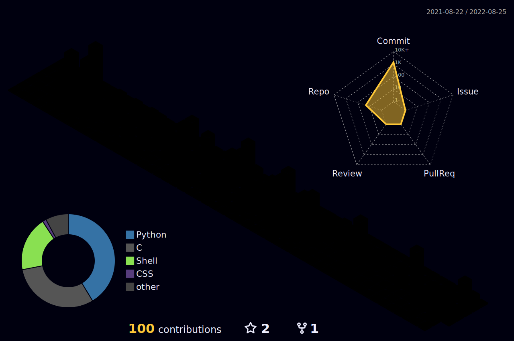

<h1 align="center">
 <abc>
  
[](https://git.io/typing-svg)
  


[](https://git.io/typing-svg)
  
 </abc>
</h1>

```python
class ReadMe:
    def __init__(self, username="Numericss", year=2022):
        self.username = username
        self.name = 'Kevin Rosario '
        self.education = {
            'IDEprograms': ['CODERUNNER', 'VISUAL STUDIO CODE', 'XCODE'],
            'Language': ['C#', 'Python', 'JavaScript', 'HTML', 'CSS', ],
            'Learning': ['Low-level programing', 'Azure', 'Higher-level programming'],
        }
```
---

---

```


      " When something is important enough, you do it even if the odds are not in your favor.
               Life is too short for long-term grudges. Some people don't like change,
                  but you need to embrace change if the alternative is disaster."
      
      
                                        - Elon Musk
             
                                                
                                            
```
