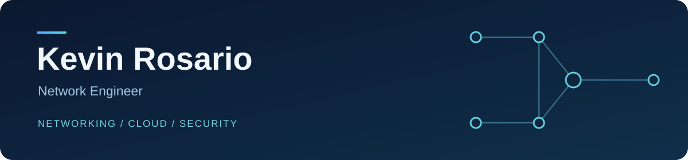

**Reliable networks. Practical automation. Tools that solve everyday problems.**

[Projects](#selected-projects) · [Networking notes](docs/local-service-troubleshooting.md) · [Toolbox](#toolbox) · [Connect](#connect)

## Hi, I'm Kevin

I'm a network engineer focused on connectivity, cloud infrastructure, and security. I work with Azure, Microsoft 365, and Google Cloud, and use Python, PowerShell, and Bash to simplify recurring tasks.

Here you'll find practical software projects alongside notes on how systems work and how to troubleshoot them.

## Selected projects

### [Bibles — Bible passages in OBS Studio](https://github.com/Numericss/Bibles)

A macOS-ready package for selecting Bible passages in a dock and displaying them through an OBS browser overlay. Includes multiple translations and local installation scripts.

**My recent work:** Improved server readiness checks, made custom ports consistent, clarified setup URLs, and added regression tests.

`Ruby` · `JavaScript` · `Shell` · `OBS Studio`

[Source & setup](https://github.com/Numericss/Bibles#readme) · [Networking walkthrough](docs/local-service-troubleshooting.md)

### [Hinge — Desktop effects for macOS](https://github.com/Numericss/Hinge)

A native macOS app that responds to a compatible MacBook lid sensor with desktop effects. Built on MacDuo, with motion presets, a menu-bar panel, and setup controls. **Version 3.0 is a development preview.**

`Swift` · `Metal` · `macOS`

See the effect preview

*Renderer demonstration using generated artwork, not a recording of physical lid movement or desktop capture.*

[Source & build instructions](https://github.com/Numericss/Hinge#readme)

## Networking in practice

### [Troubleshooting a local service: ports, HTTP, and browser communication](docs/local-service-troubleshooting.md)

A walkthrough of the Bibles setup: identify the listener, check the application response, compare browser origins, and separate server failures from overlay failures. Includes a connection diagram, read-only commands, and expected results.

**Key distinction:** An open port proves that something is listening. An application health check helps confirm that the expected service is responding.

## Toolbox

| Area | Technologies |
| :--- | :--- |
| Cloud & productivity | Azure, Microsoft 365, Google Cloud |
| Security & networking | Azure Sentinel, Wireshark |
| Scripting & automation | Python, PowerShell, Bash |
| Data & reporting | Power BI |
| Development & deployment | VS Code, Vercel |
| AI-assisted work | Claude, Claude Code, LM Studio |

## Connect

[Find me on GitHub](https://github.com/Numericss) · [Browse all repositories](https://github.com/Numericss?tab=repositories)

For questions or feedback about a project, use its repository's Issues tab.

---

*“Those who hope in the Lord will renew their strength.”*  
**Isaiah 40:31**

