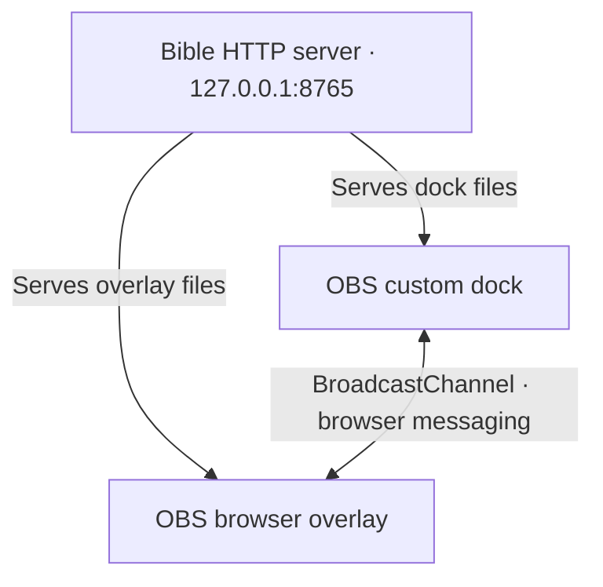

# Troubleshooting a local service

A practical walkthrough using [Bibles](https://github.com/Numericss/Bibles), an OBS Bible dock and browser overlay served from the same Mac.

The goal is to distinguish four questions: Is a process listening? Is it the expected application? Can both pages load? Can the browser contexts communicate?

## Connection map



HTTP delivers the files. Verse commands use `BroadcastChannel` between browser contexts; the Ruby server does not relay those commands. Matching origins is necessary, and the contexts must also support communication within the same browser storage partition. See [MDN’s Broadcast Channel documentation](https://developer.mozilla.org/en-US/docs/Web/API/Broadcast_Channel_API).

## 1. Identify the listener

On the Mac running OBS:

```sh
lsof -nP -iTCP:8765 -sTCP:LISTEN
```

A matching row identifies the process listening on that port. No output means this check did not find a visible listener. A listener alone does not establish that Bibles is healthy: another app could own the port.

`127.0.0.1` is loopback. On another computer, that address refers to that other computer, not the Mac running OBS.

## 2. Check the application response

```sh
curl --noproxy '*' --connect-timeout 2 --max-time 3 -i http://127.0.0.1:8765/healthz
```

The updated Bibles server returns HTTP `200` with this body:

```text
obs-bible-server:ok
```

This is a readiness signal, not authentication or proof that every feature works. An older version may not have this endpoint. If the response is different, identify the running process and installed version before changing configuration.

## 3. Check both pages

```sh
curl --noproxy '*' --connect-timeout 2 --max-time 3 -I http://127.0.0.1:8765/obs-bible-plugin-dock/index.html
curl --noproxy '*' --connect-timeout 2 --max-time 3 -I http://127.0.0.1:8765/obs-bible-plugin-browser/index.html
```

Both should return HTTP `200`. This verifies file availability; it does not test JavaScript execution or verse delivery.

## 4. Compare origins

Use these URLs in OBS:

| Component | URL |
| :--- | :--- |
| Custom dock | `http://127.0.0.1:8765/obs-bible-plugin-dock/index.html` |
| Browser source | `http://127.0.0.1:8765/obs-bible-plugin-browser/index.html` |

An origin consists of the scheme, hostname, and port. These must match. The different paths are expected.

- `localhost` and `127.0.0.1` are different hostnames for browser-origin comparisons, even when they reach the same Mac.
- Ports `8765` and `8766` are different origins.
- A `file://` page does not share this HTTP origin. Leave **Local file** unchecked in OBS.

If you choose a custom port, update both OBS URLs and pass the same `OBS_BIBLE_PORT` when running the Open/Start helpers from Terminal. Double-clicking those helpers uses the default port.

## 5. Verify inside OBS

Once both pages load, select a translation, look up a passage such as `John 3:16`, and activate it for display. Check show/hide behavior and confirm that selecting a different verse updates the overlay.

If HTTP checks pass but the overlay remains blank, inspect browser errors and OBS browser-source settings. Reload both contexts and test within OBS. An ordinary browser preview alone does not prove communication between OBS's dock and browser source.

## Symptom guide

| Symptom | Next check |
| :--- | :--- |
| Connection refused | Confirm the listener, port, and server startup log. |
| Unexpected health response | Identify the process and installed Bibles version. |
| One page returns `404` | Check its path and installed files. |
| Both pages load, overlay stays blank | Compare origins, then inspect browser messaging and display controls. |
| Browser preview works, OBS fails | Repeat the test in OBS and inspect its browser contexts. |

## Evidence and limits

The Bibles repository includes automated tests for readiness, routing, custom ports, invalid ports, and rejection of an unrelated HTTP server. They can be run from that repository with `ruby tests/server_test.rb`.

This guide documents the implementation and a diagnostic procedure. It is not a claim that physical OBS integration has passed on every machine.

[Back to profile](../README.md)
